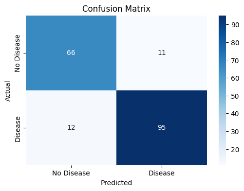
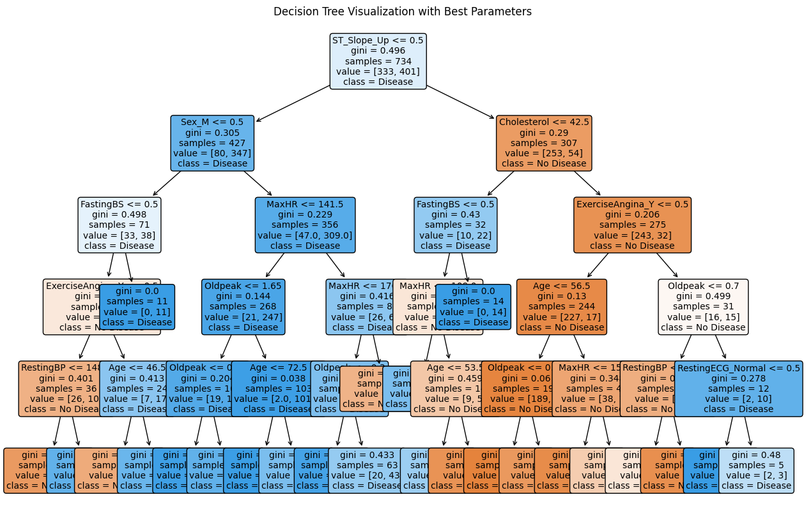

# Laporan Analisis Data dengan Decision Tree: Dataset Heart Disease

## Deskripsi Dataset
Pada tugas ini, saya menggunakan dataset **Heart Disease** yang terdiri dari 918 entri dengan 12 kolom. Dataset ini berisi informasi mengenai berbagai faktor yang mempengaruhi kesehatan jantung seseorang. Variabel target yang ingin diprediksi adalah **HeartDisease**, yang menunjukkan apakah seseorang memiliki penyakit jantung (1) atau tidak (0). Fitur-fitur yang ada dalam dataset ini antara lain:

- **Age**: Usia pasien.
- **Sex**: Jenis kelamin pasien (laki-laki atau perempuan).
- **ChestPainType**: Jenis rasa sakit dada yang dialami pasien.
- **RestingBP**: Tekanan darah saat pasien dalam keadaan istirahat.
- **Cholesterol**: Tingkat kolesterol dalam darah.
- **FastingBS**: Status gula darah puasa (0 jika normal, 1 jika lebih tinggi).
- **RestingECG**: Hasil pemeriksaan elektrokardiogram (EKG) saat istirahat.
- **MaxHR**: Denyut jantung maksimum yang tercatat saat pasien berolahraga.
- **ExerciseAngina**: Apakah pasien mengalami angina saat berolahraga.
- **Oldpeak**: Perubahan pada EKG yang terjadi selama pasien berolahraga.
- **ST_Slope**: Kemiringan segmen ST pada EKG selama latihan.
- **HeartDisease**: Variabel target yang menunjukkan apakah seseorang menderita penyakit jantung.

Dataset ini dipilih karena memberikan gambaran tentang faktor-faktor yang mempengaruhi risiko penyakit jantung, dan memprediksi penyakit jantung merupakan masalah yang sangat relevan dalam bidang kesehatan.

## Langkah-langkah Analisis

### 1. Pra-Pemrosesan Data
Sebelum membangun model **Decision Tree**, saya melakukan beberapa langkah pra-pemrosesan data:
- **Mengatasi Nilai yang Hilang**: Dataset ini tidak memiliki nilai yang hilang, sehingga tidak perlu melakukan pengisian atau penghapusan data.
- **Transformasi Variabel Kategorikal**: Kolom seperti `Sex`, `ChestPainType`, `RestingECG`, `ExerciseAngina`, dan `ST_Slope` memiliki tipe data kategorikal. Saya menggunakan **One-Hot Encoding** untuk mengubah kolom-kolom tersebut menjadi format numerik agar dapat diproses oleh model.
  
  Misalnya, kolom `Sex` yang awalnya berupa **'M'** dan **'F'** diubah menjadi dua kolom biner: **'Sex_M'** dan **'Sex_F'**. Begitu juga untuk kolom kategorikal lainnya.

### 2. Pemisahan Fitur dan Target
Setelah pra-pemrosesan, saya memisahkan dataset menjadi dua bagian:
- **Fitur (X)**: Semua kolom selain **HeartDisease**.
- **Target (y)**: Kolom **HeartDisease**, yang merupakan variabel yang ingin diprediksi oleh model.

### 3. Pembagian Data untuk Training dan Testing
Selanjutnya, dataset dibagi menjadi dua bagian:
- **Data Training (80%)**: Digunakan untuk melatih model.
- **Data Testing (20%)**: Digunakan untuk menguji seberapa baik model yang telah dilatih dalam memprediksi data yang tidak terlihat sebelumnya.

Pembagian ini dilakukan menggunakan fungsi `train_test_split` dari pustaka `scikit-learn`.

### 4. Pembuatan Model Decision Tree
Setelah data siap, saya membangun model **Decision Tree** menggunakan pustaka `scikit-learn`. Model ini dioptimalkan dengan mencari kombinasi **hyperparameter terbaik** menggunakan **GridSearchCV**. Beberapa hyperparameter yang dioptimalkan meliputi:
- **max_depth**: Kedalaman maksimum pohon keputusan.
- **min_samples_split**: Jumlah minimum sampel yang diperlukan untuk membagi sebuah node.
- **min_samples_leaf**: Jumlah minimum sampel yang diperlukan untuk membuat daun.
- **max_features**: Jumlah fitur maksimum yang dipertimbangkan pada setiap split.

GridSearchCV memungkinkan pencarian parameter terbaik melalui cross-validation, yang meningkatkan kemungkinan menemukan model yang lebih akurat.

### 5. Evaluasi Model
Setelah model dilatih menggunakan parameter terbaik, saya melakukan evaluasi menggunakan data testing. Metrik evaluasi yang digunakan meliputi:
- **Akurasi**: Seberapa sering model membuat prediksi yang benar.
- **Precision**: Proporsi prediksi positif yang benar.
- **Recall**: Proporsi kejadian positif yang terdeteksi oleh model.
- **Confusion Matrix**: Matriks yang menggambarkan performa model dalam klasifikasi dengan menunjukkan jumlah prediksi yang benar dan salah.

Berikut adalah hasil evaluasi model:

Accuracy: 0.88
Precision: 0.90
Recall: 0.89

Confusion Matrix:
[[66 11] [12 95]]

Dari hasil evaluasi tersebut, kita bisa melihat bahwa model berhasil memprediksi **HeartDisease** dengan akurasi yang cukup baik. Precision yang cukup tinggi menunjukkan bahwa model jarang salah dalam memprediksi pasien yang sehat sebagai sakit jantung. Namun, recall yang tinggi juga menunjukkan bahwa model cukup sensitif dalam mendeteksi pasien yang sebenarnya memiliki penyakit jantung.

### 6. Visualisasi Confusion Matrix
Untuk lebih memahami kinerja model, saya memvisualisasikan **Confusion Matrix** menggunakan heatmap. Ini memberikan gambaran yang lebih jelas tentang bagaimana model membagi data antara kelas yang benar dan yang salah.

### 7. Visualisasi Decision Tree
Akhirnya, saya memvisualisasikan pohon keputusan yang dibangun oleh model. Visualisasi ini menunjukkan bagaimana model membuat keputusan pada setiap node berdasarkan fitur-fitur yang ada.

### 8. Analisis Hasil
Dari visualisasi pohon keputusan, kita bisa melihat bahwa fitur-fitur seperti **ChestPainType**, **RestingBP**, dan **Cholesterol** memiliki pengaruh besar dalam keputusan yang dibuat oleh model. Misalnya, pada node pertama, **ChestPainType** digunakan untuk memisahkan pasien yang berisiko tinggi dan rendah terkena penyakit jantung.

### 9. Rekomendasi dan Saran
Berdasarkan hasil model, saya menyarankan untuk lebih fokus pada fitur-fitur yang memiliki pengaruh besar terhadap risiko penyakit jantung, seperti **ChestPainType** dan **Cholesterol**. Selain itu, model ini dapat ditingkatkan lebih lanjut dengan mencoba algoritma lain atau menambah data untuk mengurangi overfitting.

## Kesimpulan
Melalui penggunaan model **Decision Tree**, saya berhasil membangun sistem yang dapat memprediksi kemungkinan seseorang menderita **HeartDisease** berdasarkan sejumlah fitur kesehatan. Meskipun model ini menunjukkan performa yang baik, masih ada ruang untuk perbaikan lebih lanjut dengan eksplorasi fitur tambahan atau algoritma lain.
